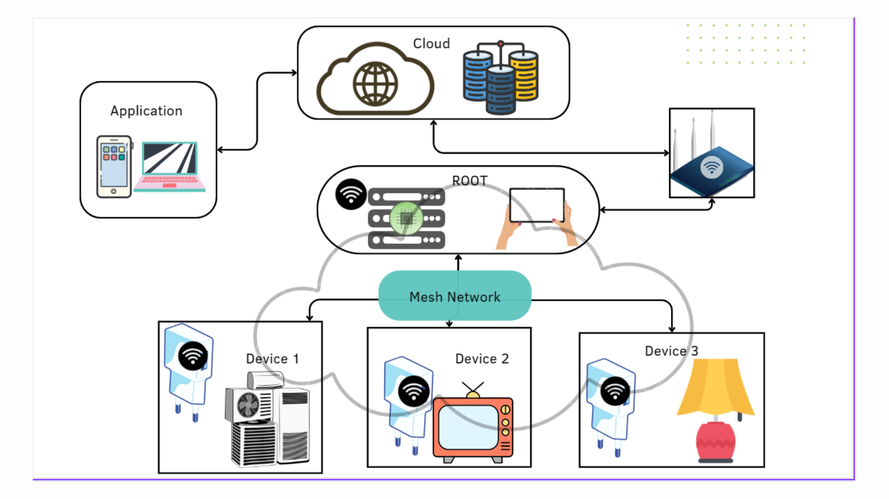
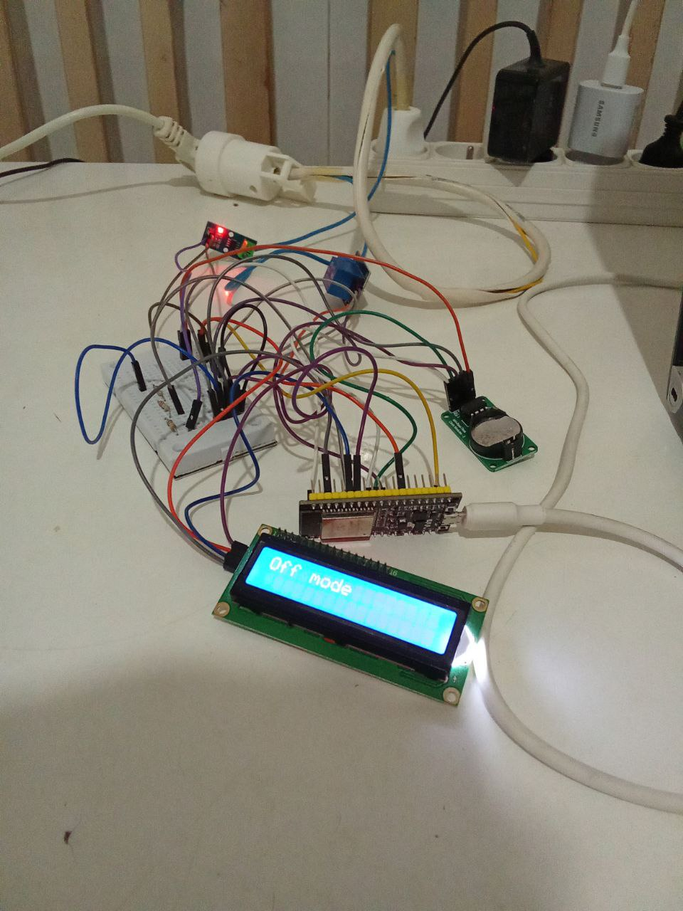

# Smart Plug Control System
This academic project is a team effort involving Mariem, Ameni, Tayssir, and Moktar.

We created a solution where a user can control a plug via a web interface created with Symfony. The user can turn the plug on or off, or set a timer for the plug to be on for a specified duration. Additionally, we added the ability to measure power consumption using a current sensor.

## How the System Works

### Overall Design
- Application Side (Web): We used Symfony to manage the web application and MySQL database. Additionally, we utilized Flask as a REST API server to communicate with the gateway.
- Gateway (Root): Manages all the plugs configured by the user and communicates with them via ESP-NOW, creating a mesh network.
- Plug (Device): Receives configurations from the gateway and performs the specified functions.

Sympfony application Code: [Link](https://github.com/baatourtayssir/project_architecture)

A demonstration Video Link: [Video](https://drive.google.com/drive/u/0/folders/1g73PlBjbIHuQ6YHDv4JCbkXF6pLsu6W7) 

####  Step 1: Configuration
The user configures the gateway and the plug to connect to the local network and establish communication with the server via a self-hosted webpage.

After configuration is complete, a firmware update over the air (OTA) will occur to set the firmware of the gateway and the plug. The WiFi settings and the server IP address are saved in LittleFS.

#### Step 2: Device Configuration
The user logs into the Symfony application to configure the device. The configuration involves setting a MAC address, a name (e.g., 'Lamp'), a location (e.g., 'Kitchen'), and a function (ON/Off/Timer). All configured devices will be sent to the gateway. Communication between the gateway and the server is over WiFi, utilizing the REST API to send and receive requests.

#### Step 3: Gateway and Device Communication
The gateway receives the connected devices in JSON format, then parses this data and maps it into a table of structs. Each table element is a struct representing a device and its configuration. The gateway then waits for a plug to establish communication over ESP-NOW. An authentication process will compare the MAC address of the device with the list of connected devices. If authentication is successful, it will send the configuration over ESP-NOW to the device; otherwise, it will ignore the device. The gateway can also update the device with new configurations or remove it from the list of connected devices.

#### Step 4: Device Operation
The device gets configured and performs the specified function (On, Off, etc.). If the function is 'On', the current consumption will be displayed on an LCD. If the function is 'Timer', the LCD will display a countdown and the current consumption.
## Tools Used in This Project
### Development Environment
In this project, I opted not to use the Arduino IDE. Instead, I created my own development environment using PlatformIO CLI and used Neovim as my IDE.

### Hardware

- ESP32 for the Gateway
- ESP32 for the Device
- Relay
- I2C LCD
- ASC-712 Current Sensor

Both the gateway and the plug are powered via USB cables.

#####  Note: 
This is the first version of the smart plug.

Currently the gateway can only configure one plug, the next version will focus more on managing multiple plugs. 

Set a unified programming style (probably C++) and use the OOP paradigm while implementing software design principles.

# Contributors
- [@Onizuka09]()

- [@Amanislh22]() 

- [@mariemnajjar]() 

- [@baatourtayssir]()

